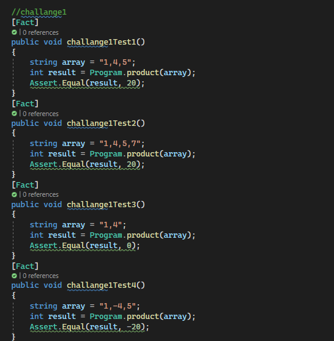
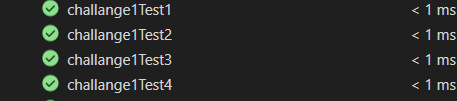

# lab03-review
this is a challanges that summarize all what we tooke previously form exception and file and system io also testing functions .
this is the whitebord for one of the challanges that takes a 3 numbers in a string and they are seprated by commas then gives a product number as an  output  the challange whitebord:

as you can see we tested this by checking in the code if the length is less than 3 it  will return 0 and if it is more than 3 it will return only will the product the product of the first 3 and also the negative numbers.
this is the code of the unit test and the testes cheacked:

